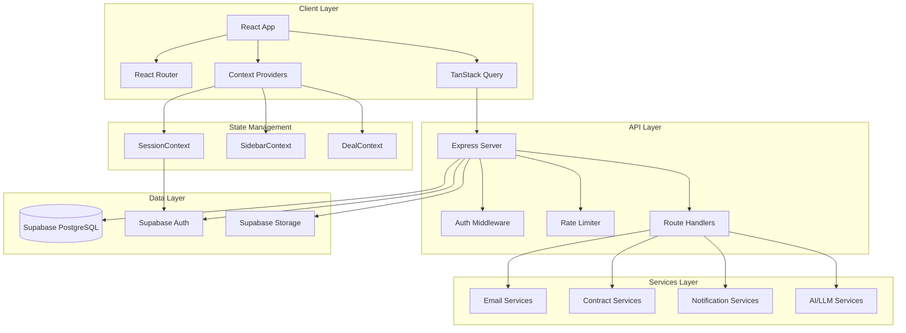
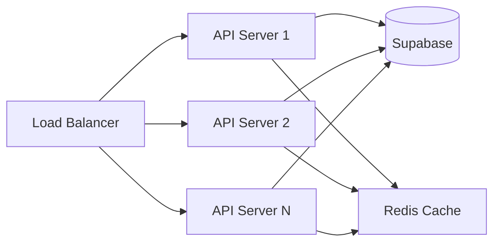

# CreatorArmour Architecture Review

**Date:** March 31, 2026  
**Version:** 1.0.0  
**Reviewer:** Architecture Analysis

---

## Executive Summary

CreatorArmour is a comprehensive creator-brand collaboration platform built with a modern tech stack. The application enables creators to manage brand deals, contracts, payments, and protect their collaborations. This review identifies architectural strengths, areas for improvement, and provides actionable recommendations.

---

## 1. Technology Stack Overview

### Frontend
| Technology | Version | Purpose |
|------------|---------|---------|
| React | 18.3.1 | UI Framework |
| TypeScript | 5.5.3 | Type Safety |
| Vite | 6.3.4 | Build Tool |
| React Router | 6.26.2 | Routing |
| TanStack Query | 5.56.2 | Server State Management |
| Tailwind CSS | 3.4.11 | Styling |
| Shadcn/UI | - | Component Library |
| Framer Motion | 12.38.0 | Animations |
| Supabase JS | 2.74.0 | Backend-as-a-Service |

### Backend
| Technology | Version | Purpose |
|------------|---------|---------|
| Express | 4.18.2 | API Server |
| TypeScript | 5.5.3 | Type Safety |
| Supabase | 2.74.0 | Database & Auth |
| Resend | - | Email Service |
| Puppeteer | 21.6.1 | PDF Generation |
| Web Push | 3.6.7 | Push Notifications |

---

## 2. Architecture Diagram



---

## 3. Current Architecture Analysis

### 3.1 Frontend Architecture

#### Strengths
- **Modern Stack**: React 18 with TypeScript and Vite provides excellent DX and performance
- **Component Library**: Shadcn/UI offers consistent, accessible components
- **Server State Management**: TanStack Query handles caching, refetching, and optimistic updates
- **Route Organization**: Routes are split by user type - creator, brand, client, public

#### Areas for Improvement

**1. Oversized Page Components**

Several page components are extremely large, violating single-responsibility principle:

| File | Size | Issue |
|------|------|-------|
| [`MobileDashboardDemo.tsx`](src/pages/MobileDashboardDemo.tsx) | 518K chars | Monolithic dashboard |
| [`ContractUploadFlow.tsx`](src/pages/ContractUploadFlow.tsx) | 356K chars | Complex flow in single file |
| [`BrandMobileDashboard.tsx`](src/pages/BrandMobileDashboard.tsx) | 334K chars | Duplicate dashboard logic |
| [`DealDetailPage.tsx`](src/pages/DealDetailPage.tsx) | 188K chars | Complex deal management |
| [`CollabLinkLanding.tsx`](src/pages/CollabLinkLanding.tsx) | 220K chars | Landing page with too many concerns |

**Recommendation:** Break these into smaller, focused components using component composition patterns.

**2. SessionContext Complexity**

The [`SessionContext.tsx`](src/contexts/SessionContext.tsx) at 844 lines handles:
- OAuth token parsing
- Session management
- Profile fetching
- Route redirection logic
- Trial status management

**Recommendation:** Split into separate contexts:
- `AuthContext` - Authentication state
- `ProfileContext` - User profile data
- `OAuthContext` - OAuth flow handling

**3. Direct Supabase Calls**

Components make direct Supabase calls instead of going through an abstraction layer:

```typescript
// Current pattern - scattered throughout components
const { data, error } = await supabase
  .from('profiles')
  .select('*')
  .eq('id', userId);
```

**Recommendation:** Create a repository pattern or API client layer.

### 3.2 Backend Architecture

#### Strengths
- **Modular Route Organization**: Routes are organized by domain
- **Service Layer**: Business logic is separated into service files
- **Middleware Stack**: Auth, rate limiting, and error handling are properly abstracted
- **CORS Configuration**: Comprehensive origin handling for various deployment scenarios

#### Areas for Improvement

**1. Large Route Files**

| File | Size | Issue |
|------|------|-------|
| [`protection.ts`](server/src/routes/protection.ts) | 125K chars | Too many endpoints |
| [`collabRequests.ts`](server/src/routes/collabRequests.ts) | 130K chars | Complex request handling |
| [`deals.ts`](server/src/routes/deals.ts) | 66K chars | Deal management |

**Recommendation:** Split into focused sub-routers.

**2. Inconsistent Error Handling**

Some routes use try-catch with custom errors, others use generic error objects:

```typescript
// Inconsistent patterns across routes
return res.status(500).json({ error: 'Failed to...' });
// vs
throw new Error('Failed to...');
```

**Recommendation:** Implement custom error classes and centralized error handling.

**3. Service File Organization**

Services are flat in a single directory with 40+ files:

```
server/src/services/
├── aiContractAnalysis.ts
├── brandAuthService.ts
├── ... (40+ files)
└── virusScan.ts
```

**Recommendation:** Organize by domain:

```
server/src/services/
├── contracts/
│   ├── generator.ts
│   ├── analyzer.ts
│   └── signing.ts
├── notifications/
│   ├── email.ts
│   ├── push.ts
│   └── sms.ts
└── creators/
    ├── profile.ts
    └── onboarding.ts
```

### 3.3 Data Layer

#### Strengths
- **Type Safety**: Generated Supabase types in [`types/supabase.ts`](server/src/types/supabase.ts)
- **RLS Policies**: Row-level security for data isolation
- **Real-time Capabilities**: Supabase real-time for live updates

#### Areas for Improvement

**1. Type Definition Drift**

The [`Profile`](src/types/index.ts:20) type has many optional fields manually added, risking drift from database schema:

```typescript
export type Profile = Tables<'profiles'> & {
  role: 'client' | 'admin' | 'chartered_accountant' | 'creator' | 'lawyer' | 'brand';
  business_name?: string | null;
  gstin?: string | null;
  // ... 100+ manually added fields
};
```

**Recommendation:** Use Supabase CLI to regenerate types automatically.

**2. N+1 Query Patterns**

Some endpoints fetch related data inefficiently:

```typescript
// Potential N+1 pattern
for (const deal of deals) {
  const { data: profile } = await supabase
    .from('profiles')
    .select('*')
    .eq('id', deal.creator_id);
}
```

**Recommendation:** Use Supabase joins or batch queries.

---

## 4. Security Considerations

### Current Security Measures
- ✅ Row-level security (RLS) on Supabase
- ✅ Service role key protection
- ✅ Rate limiting middleware
- ✅ CORS configuration
- ✅ Helmet for HTTP headers

### Recommendations

**1. API Key Rotation**
Implement automated API key rotation for Supabase service role keys.

**2. Input Validation**
Add Zod or Yup schemas for request validation:

```typescript
import { z } from 'zod';

const CreateDealSchema = z.object({
  brand_name: z.string().min(1).max(100),
  deal_amount: z.number().positive(),
  deliverables: z.array(z.string()).min(1),
});
```

**3. Audit Logging**
Implement comprehensive audit logging for sensitive operations.

---

## 5. Performance Recommendations

### Frontend

**1. Code Splitting**
Implement route-based code splitting:

```typescript
const CreatorDashboard = lazy(() => import('./pages/CreatorDashboard'));
const BrandDashboard = lazy(() => import('./pages/BrandDashboard'));
```

**2. Component Memoization**
Use `React.memo` and `useMemo` for expensive computations in large components.

**3. Virtual Scrolling**
Implement virtual scrolling for long lists (creator directory, deal lists).

### Backend

**1. Connection Pooling**
Configure Supabase connection pooling for serverless deployments.

**2. Caching Layer**
Add Redis for:
- Session caching
- Rate limit counters
- Frequently accessed data

**3. Background Jobs**
Move heavy operations to background jobs:
- Contract PDF generation
- Email sending
- Instagram data sync

---

## 6. Scalability Recommendations

### Horizontal Scaling



### Database Scaling
- Implement read replicas for reporting queries
- Partition large tables by date or tenant
- Archive old deals to cold storage

---

## 7. Developer Experience Improvements

### Testing
Current test coverage appears minimal. Recommendations:

1. **Unit Tests**: Add Jest/Vitest for service layer
2. **Integration Tests**: Add Supertest for API endpoints
3. **E2E Tests**: Expand Playwright coverage

### Documentation
1. Add OpenAPI/Swagger documentation for API
2. Document component props with Storybook
3. Add architecture decision records (ADRs)

### CI/CD
1. Add automated type checking
2. Add bundle size monitoring
3. Implement preview deployments

---

## 8. Priority Action Items

### High Priority
1. **Break down oversized components** - Start with `MobileDashboardDemo.tsx`
2. **Split SessionContext** - Separate auth from profile management
3. **Add input validation** - Implement Zod schemas
4. **Implement proper error handling** - Custom error classes

### Medium Priority
1. **Reorganize services by domain**
2. **Add Redis caching layer**
3. **Implement background jobs**
4. **Add comprehensive logging**

### Low Priority
1. **Migrate to React Server Components** (when stable)
2. **Implement microservices for specific domains**
3. **Add comprehensive monitoring**

---

## 9. Proposed Architecture Evolution

### Current State
```
┌─────────────────────────────────────┐
│           Monolithic App            │
│  ┌─────────┐  ┌─────────┐          │
│  │ Frontend│  │ Backend │          │
│  │  (React)│  │ (Express)│          │
│  └────┬────┘  └────┬────┘          │
│       │            │                │
│       └──────┬─────┘                │
│              ▼                      │
│        ┌──────────┐                 │
│        │ Supabase │                 │
│        └──────────┘                 │
└─────────────────────────────────────┘
```

### Target State
```
┌─────────────────────────────────────────────────────┐
│                    CreatorArmour                    │
│                                                      │
│  ┌──────────────┐    ┌──────────────────────────┐  │
│  │   Frontend   │    │     API Gateway          │  │
│  │   (React)    │───▶│     (Express)            │  │
│  │              │    │                          │  │
│  │ ┌──────────┐ │    │  ┌────────────────────┐  │  │
│  │ │Features  │ │    │  │ Domain Services    │  │  │
│  │ │- Creator │ │    │  │ ┌────────────────┐ │  │  │
│  │ │- Brand   │ │    │  │ │ Contracts      │ │  │  │
│  │ │- Admin   │ │    │  │ │ Notifications  │ │  │  │
│  │ └──────────┘ │    │  │ │ Deals          │ │  │  │
│  └──────────────┘    │  │ │ Creators       │ │  │  │
│                      │  │ └────────────────┘ │  │  │
│                      │  └────────────────────┘  │  │
│                      └───────────┬──────────────┘  │
│                                  │                  │
│              ┌───────────────────┼──────────────┐  │
│              ▼                   ▼              ▼  │
│        ┌──────────┐       ┌──────────┐   ┌───────┐ │
│        │ Supabase │       │  Redis   │   │ Queue │ │
│        │  (Data)  │       │ (Cache)  │   │(Bull) │ │
│        └──────────┘       └──────────┘   └───────┘ │
└─────────────────────────────────────────────────────┘
```

---

## 10. Conclusion

CreatorArmour has a solid foundation with modern technologies and good separation of concerns. The main areas for improvement are:

1. **Component Size**: Break down monolithic components
2. **State Management**: Simplify context structure
3. **Service Organization**: Domain-driven organization
4. **Testing**: Comprehensive test coverage
5. **Performance**: Caching and background jobs

Implementing these recommendations will improve maintainability, scalability, and developer experience.

---

**Next Steps:**
1. Review this document with the team
2. Prioritize action items based on business needs
3. Create implementation tickets for high-priority items
4. Schedule regular architecture reviews
